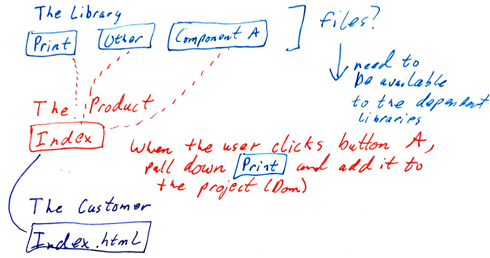

# The Dependency (The Library)

NOTE: This branch is abandoned as it seems to not be the way to go.  The idea was to have the `import` be in the dependency but that would force the clients to have to manually copy/paste the `print.js` file.  Then that client would also have to direct the dependency where the root of the file should be.

I assume this is not a normal way to use this type of thing.

--------

This is the simple dependency that produces a split code.  This code split should then be available in the supporting libraries.

Here's a rough sketch:

The idea is that this library has many things it can present and they should be loaded separately and on demand.